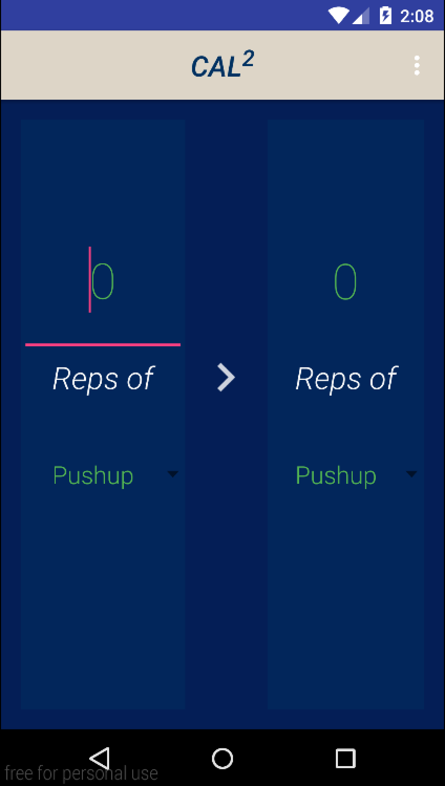
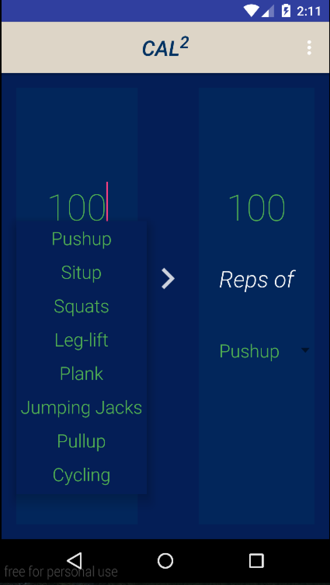
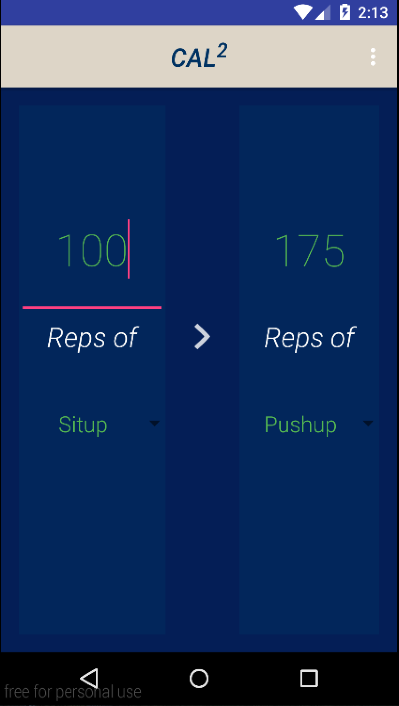
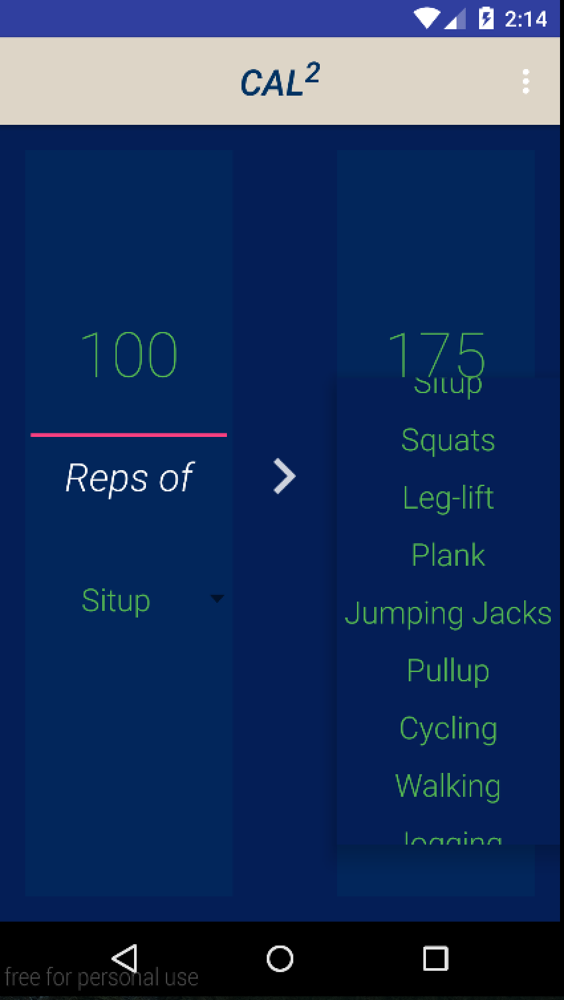
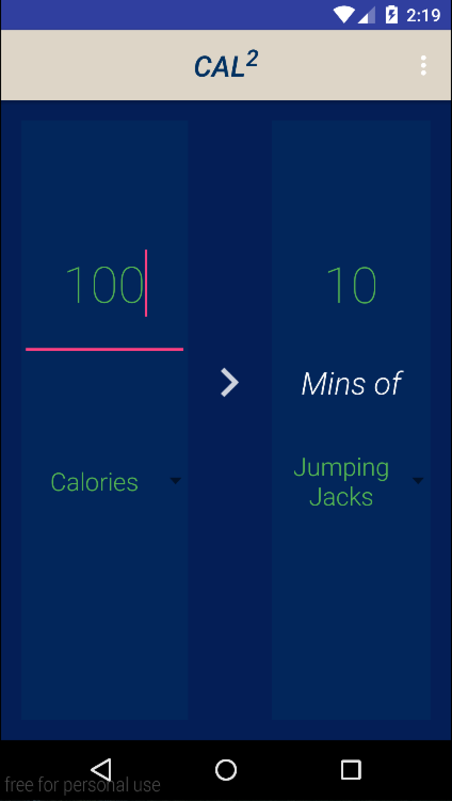

# PROG 01: Crunch Time

CAL2 is an simple app that let users convert between their workout efforts and
calories counts. It features a simple-to-use interface, in which user can input
the amount of the exercise they do and immediately see the equivalent calories
burned or equivalent amount of other types of exercises. It also supports
converting calorie counts to the amount of exercises needed. Currently it
supports 12 types of common exercises.

## Authors

Jian Qiao ([jian.qiao@berkeley.edu](mailto:jian.qiao@berkeley.edu))

## Demo Video

See [your demo video title here] (https://link_to_your_video)

## Screenshots

## Acknowledgments

* Hat tip to anyone who's code was used
